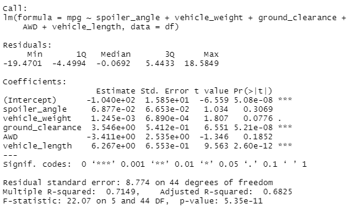
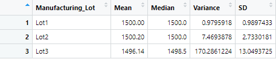
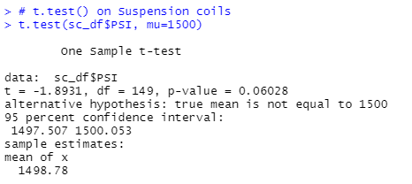
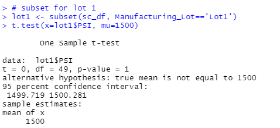
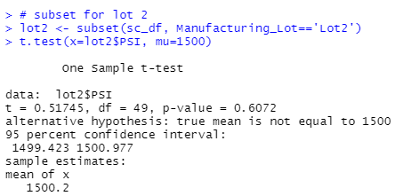
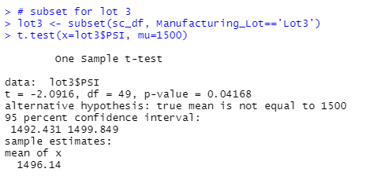

# MechaCar_Statistical_Analysis

# Overview of the Analysis:

This project is to assist the data analytics teams from AutosRUs on the MechaCar project. By using RStudio, we will perform the multivariable linear regression on the mpg dataset, and a series of tests, to determine the following analytical questions:
1. Perform multiple linear regression analysis to identify which variables in the dataset predict the mpg of MechaCar prototypes
2. Collect summary statistics on the pounds per square inch (PSI) of the suspension coils from the manufacturing lots
3. Run t-tests to determine if the manufacturing lots are statistically different from the mean population
4. Design a statistical study to compare vehicle performance of the MechaCar vehicles against vehicles from other manufacturers. 

## Linear Regression (Deliverable 1)
By performing linear regression on the mpg dataset, the following result was shown. 

- As shown by the P-values in the previous data, Spoiler Angle, AWS, and Vehicle Weight all provides the greatest non-random variance to MPG. 
- The slope of the linear model cannot be considered as zero, as the Estimates of the Coefficients from the data shown above shows a non-zero value. 
- The multiple R-squared value from the data shown above is 0.7149, which can be considered as an effective regression model.

## Summary Statistics on Suspension Coils
The following is the Mean, Median, Variance and SD values. 

The manufacturer's specifications states that the suspension coil should not exceed 100 PSI. From the previous data, the Variance is showing a value of 62.3, which is well within the manufacturer's specifications. 

The following is the data analysis performed by grouping Manufacturing Lots. 

THe previous set of data shows that manufacturing lot 3 does not pass the specification parameter for the 100 PSI requirement. As a result, it is highly recommend that Lot 3 undergoes a qualify control to properly regulate its manufacturing consistency, and determine the cause of the unreliable productions. 

## T-Tests on Suspension Coils
The following are the results performed on the provided suspension coil data. 

